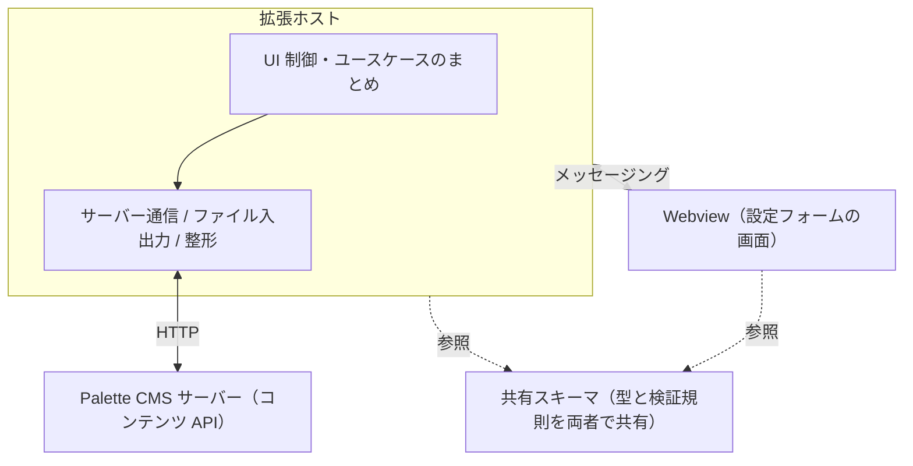

# Palette CMS Content Sync — 設計の思想

## 1. 何のための拡張か

Palette CMS（別リポジトリの CMS 本体）で管理する Web コンテンツ（テンプレートや各種設定）を、CMS の管理画面ではなく使い慣れたエディタで編集し、サーバーと同期するための拡張。

コンテンツを「設定（メタ情報）」と「コード（HTML など本文）」としてローカルのファイルに落とし込み、サーバーへ反映（アップロード）し、サーバーから取得（ダウンロード）する。補完やシンタックスハイライト、検証結果のエディタ表示といった、エディタならではの開発体験を提供することが狙い。

## 2. 全体構成の考え方

拡張ホスト・Webview・共有スキーマの三者で構成する。型と検証規則を共有スキーマに置き、ホストと画面の両方がそれを使うのが特徴。

- **拡張ホスト**：VS Code・ファイル・サーバー通信を担う中枢。
- **Webview**：設定フォームの画面。状態は持たず、ホストから受け取った値を表示する（[state-management.md](state-management.md)）。
- **共有スキーマ**：型と検証規則を一箇所に定義し、ホストと画面の双方が同じ規則でデータを検証できるようにする。境界をまたいでもデータの整合を保つための要。

## 3. 設計の柱（思想）

### 境界を信頼しない
サーバー応答・ファイル・画面とのメッセージなど、外から来るデータは境界でスキーマ検証し、不正なら安全に失敗させる。内部のどこかで暗黙に壊れたデータが流れ続けることを防ぐ。

### エラーを戻り値として扱う
処理結果を成功／失敗の値として返し、表示層がその種類（一般的な失敗・入力検証の失敗・コンパイルの失敗）に応じて、通知・画面表示・エディタ診断へ振り分ける。例外に頼らず、結果の扱いを一貫させて流れを追いやすくする。

### 責務を層で分ける
サーバー通信・ユースケースのまとめ・永続化・整形・UI を分離する。各層は自分の関心ごとだけを持ち、ユースケース層がそれらを束ねて全体の流れを組み立てる。

### サーバーを正として同期する
アップロード後は必ずサーバーから取得し直し、ローカルをサーバーの値で上書きする。サーバー側で行われる採番や整形を取り込み、ローカルとサーバーの乖離を防ぐため。どちらが正かを「サーバー」に固定することで、同期の考え方を単純に保つ。

### 環境差を一箇所に閉じ込める
コンテンツの識別方法などは CMS のバージョン（環境）によって異なる。その差を専用の層に閉じ込め、呼び出し側はバージョンを意識せずに同じ手順で扱えるようにする。分岐の知識が各所に散らばらないことを優先する。

### 画面のフォームは定義から組み立てる
入力項目・選択肢・保持する項目は、サーバー由来の「定義」から解決する。フォームを定義駆動にすることで、サーバー側のスキーマ変更に追従しやすくする。

## 4. データの考え方：環境間で共通の識別子

この設計の中心にあるのが、コンテンツの識別方法である。

複数の環境（たとえば開発と本番）は、同じ意味のコンテンツでも内部の主キーが環境ごとに異なる。主キーで管理すると、環境をまたいで「同一のコンテンツ」を同定できない。

そこで、**ユーザーが編集できる人間可読なコンテンツ ID**でコンテンツを識別し、環境をまたいで共通の意味を持たせる。これにより、

- 環境を切り替えても、同じコンテンツ ID で同じコンテンツを指せる。
- 「作成」と「更新」を区別せず、同じコンテンツ ID に対して「あれば更新・なければ作成」で書き込みを一本化できる。環境ごとに有無が異なっても、同じ操作で扱える。

環境（同期先）の切り替えに対応するのも、この共通識別子があってこそ成り立つ。

## 5. 用語（最小限）

- **コンテンツ ID**：ユーザーが決める、環境をまたいで共通のコンテンツ識別子。識別の基盤。
- **定義**：サーバー由来の、項目・選択肢・保持する項目のスキーマ。画面のフォームと、ローカルに保存する項目を駆動する。
- **接続先（環境）**：同期対象の Palette CMS 環境。切り替えられる。
- **コード**：コンテンツに属する HTML などの本文。設定（メタ情報）とは別のファイルとして扱う。
