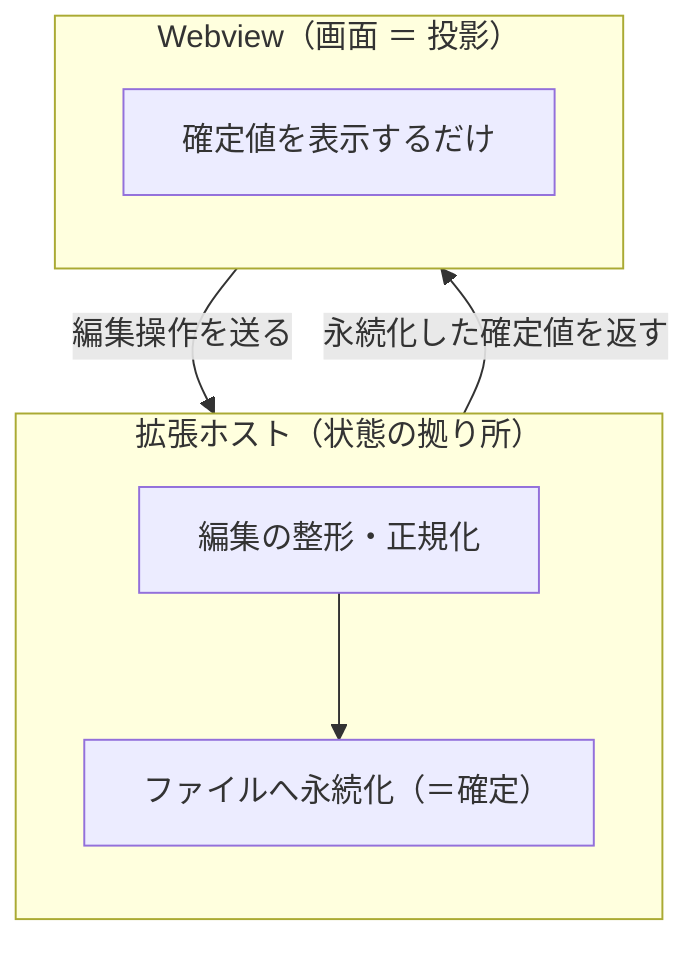
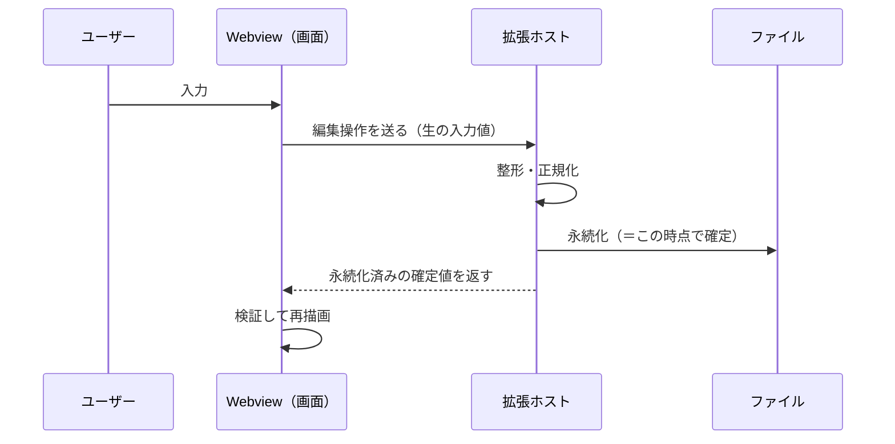

# 状態管理の設計と思想

## 要点

- 状態の唯一の拠り所は、**拡張ホストと、ホストが書き出すファイル**。Webview（設定フォームの画面）は状態を持つ主体ではなく、ホストから受け取った確定値を映すだけの投影である。
- データの流れは **ホスト → 画面 → ホスト → …** の一方向の循環。画面での編集は画面上で確定させず、必ずホストへ送り、ホストが永続化したうえで確定値を返す。
- クライアント側の状態管理ライブラリ（jotai / zustand など）は意図的に使わない。

## なぜこの形か

クライアント側に状態を持たせると、「画面が持つ状態」と「ファイルが持つ状態」という**二つの拠り所**が生まれ、両者の同期ズレという典型的なバグを抱える。そこで拠り所をホストとファイルの一箇所に定め、画面はその投影に徹する。編集を一方向の循環でホストへ戻し、永続化してから確定値を返すことで、**「状態が変わる地点」を永続化の一点に集約**でき、流れを追いやすくなる。

クライアント状態管理ライブラリが解決するのは「複雑なクライアント共有状態」だが、この設計ではそもそもクライアントが状態を保持しないため、ライブラリが管理すべき対象が存在しない。導入は二つ目の拠り所を増やすだけで利得がない（不要なものは入れない）。

## 流れ（概念図）

### 1周の流れ

確定するのは画面ではなくホストの永続化である、という点がこの設計の核心。

## 原則

1. **拠り所はホストとファイル**。画面は派生表示にすぎない。これにより状態の二重化＝同期ズレを構造的に避ける。
2. **一方向の循環で単純化**。状態が変わる地点が永続化の一点に集約され、追跡しやすい。
3. **永続化が先、表示は後**。画面に出る値は常に永続化済みの確定値。
4. **整形はホストが担う**。画面は生の入力を送るだけで整形ロジックを持たず、薄く保つ。
5. **境界を信頼せず検証する**。メッセージをまたいで受け取ったデータは、受け取り側でもスキーマ検証してから採用する。
6. **クライアント状態管理ライブラリを使わない**。前述のとおり管理すべきクライアント状態が無く、導入は二つ目の拠り所を生むだけで利得がないため。

## 後続開発者へ

- 状態の拠り所はホストとファイルに置く。画面の一時状態を編集の最終確定地点にしない。
- 編集は必ずホストへ往復させ、永続化した確定値を投影する。画面側だけで値を確定・保持して進めると、単一の拠り所が崩れる。
- 編集項目を増やすときも「送る → ホストで整形・永続化 → 確定値を返す」という循環に沿わせる。
- 境界をまたぐデータは検証してから使う。
